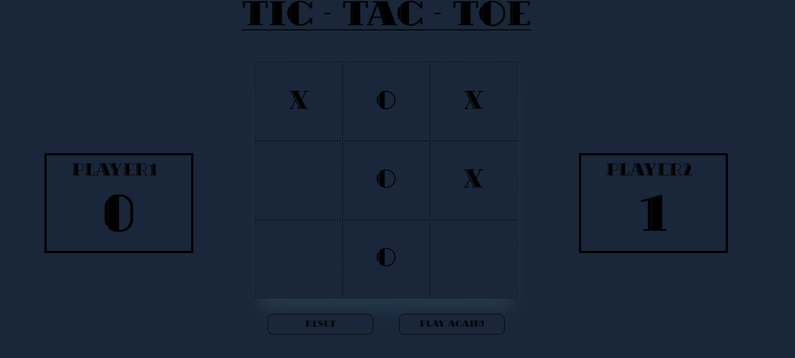
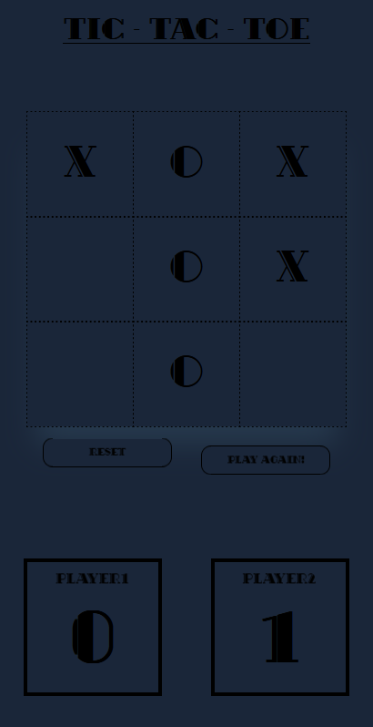

# Tic-Tac-Toe Game

This project is a simple Tic-Tac-Toe game implemented with HTML, CSS, and JavaScript. It allows two players to input their names, play the game, and keep track of their scores. The game provides options to reset the game or play again.

# Features

+ Two-player gameplay with custom player names
+ Real-time score tracking
+ Option to reset the game and scores
+ Option to play again without resetting scores
+ Dialog box to announce the winner or a draw

# Usage

Enter Player Names:
    Input names for Player 1 and Player 2 in the provided text fields.

Play the Game:
    Click on any cell to make a move. Player 1 uses "X" and Player 2 uses "O".
    The game will automatically check for a win or a draw.

Reset the Game:
    Click the "Reset" button to reset the game board and player scores.

Play Again:
    Click the "Play Again!" button to start a new game without resetting the scores.

# ScreenShots

DESKTOP DESIGN

MOBILE DESIGN

# Contributing

Feel free to open issues or submit pull requests if you have suggestions or improvements.

# Live Preview

https://shivanerana.github.io/Odin-tic-tac-toe/

Feel free to add or modify sections based on additional features or details about your project!